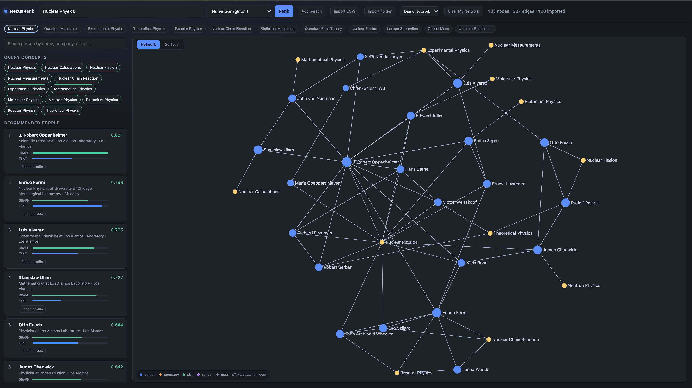

# NexusRank

Local graph navigation for professional networks.

NexusRank imports a LinkedIn data export folder and builds a local graph of
people, companies, schools, skills, certifications, followed organizations,
saved items, and profile history. Queries are ranked with BM25 plus
query-conditioned Personalized PageRank, then displayed as a network and as a
3D relevance surface.



## Why This Exists

Most technical tools, including repository browsers such as GitHub, are usually
navigated as trees, lists, and keyword search results. That works well for files,
issues, commits, and explicit links, but it is less natural when the main task is
to explore relationships between people, skills, companies, and institutions.

NexusRank is built around graph navigation instead:

- Search results are ranked by both text match and network structure.
- Every recommendation can be explained by an evidence path.
- The graph view shows why people, companies, schools, and skills cluster.
- The Surface view turns relevance into terrain, making dense areas and query
  peaks easier to inspect visually.
- The same interface works for a Manhattan Project demo network or a private
  local LinkedIn export.

It is not a replacement for GitHub. It is a different navigation pattern: better
for exploring relationships, context, and “who is connected to what?” questions
than for browsing files or commits.

## Features

- Local-only FastAPI backend and React frontend.
- SQLite persistence.
- Separate `Demo Network` and `My Network` datasets.
- Demo graph with Manhattan Project physicists and mathematicians.
- LinkedIn export folder import.
- Manual people and profile enrichment.
- Query suggestions generated from the active dataset.
- Person search by name, company, role, or profile text.
- Graph ranking with BM25 + query-conditioned Personalized PageRank.
- Evidence paths for ranked people.
- Network view with Sigma.js.
- Surface view with Three.js.
- Local API token, restricted CORS, local host guard, and disabled API docs.
- No scraping, browser automation, login automation, or LinkedIn bot behavior.

## Quickstart

```bash
./run.sh
```

Then open:

```text
http://127.0.0.1:5173
```

`run.sh` starts:

- backend on `127.0.0.1:8000`
- frontend on `127.0.0.1:5173`
- a local per-run API token

The app is intended to run locally only.

## Importing LinkedIn Data

Download your LinkedIn data export, then use `Import Folder` and select the
export folder. NexusRank reads useful CSV files when present:

- `Connections.csv`
- `Profile.csv`
- `Positions.csv`
- `Education.csv`
- `Skills.csv`
- `Certifications.csv`
- `Company Follows.csv`
- `Member_Follows_*.csv`
- `Rich_Media.csv`
- `Saved_Items_*.csv`
- `Inferences_about_you.csv`

The importer creates:

- contact nodes
- your own `person:me` profile node
- company, school, skill, activity, field, and project nodes
- `WORKED_AT`, `STUDIED_AT`, `SKILLED_IN`, `MEMBER_OF`, `WORKED_ON`, and
  generated `KNOWS` edges

Re-importing is an UPSERT operation, not a duplicate append.

`Connections.csv` usually contains the latest visible role and company for each
contact, not the full career history. For a more accurate graph, enrich important
profiles manually after import by adding education, previous roles, skills,
activities, and projects.

NexusRank works only with files you already have locally. It does not log in to
LinkedIn, scrape profiles, call LinkedIn APIs, crawl pages, bypass rate limits,
or automate browser actions.

## Demo Vs My Network

`Demo Network` and `My Network` are separate datasets inside SQLite.

- Demo data is separate from user data and contains public historical profiles of
  Manhattan Project physicists and mathematicians for screenshots and exploration.
- My Network is built from your imported or manually entered data.
- Query concepts and suggestions are generated from the active dataset only.
- `Clear My Network` deletes user network data but leaves the demo separate.

## How Ranking Works

1. BM25 finds matching nodes across the active dataset.
2. Matching concept nodes become weighted query seeds.
3. Personalized PageRank propagates relevance through typed graph edges.
4. BM25 and graph scores are fused into a final ranking.
5. The graph explains each result through an evidence path.

The ranking math lives in:

```text
backend/nexusrank/engine.py
backend/nexusrank/ppr.py
backend/nexusrank/lexical.py
backend/nexusrank/graph.py
```

## Surface View

Surface view is a visual layer over the existing ranking. It does not re-rank.

It maps the active query into a 3D relevance field:

- higher terrain means higher query relevance
- seeds are shown as query concepts
- recommended people become markers
- visible graph edges show local structure
- camera controls support tilt, top view, close view, rotate, pan, auto-rotate,
  and reset

This makes exploration more spatial than a flat list: instead of only reading
ranked results, you can see clusters, peaks, and bridges.

## Security And Acceptable Use

NexusRank is designed as a local-first personal tool, not a hosted SaaS product.

What the app does:

- binds backend and frontend to `127.0.0.1`
- stores data in a local SQLite database
- keeps imported LinkedIn data on your machine
- uses a per-run local API token
- restricts CORS to local origins
- blocks non-local `Host`, `Origin`, and `Referer` values
- blocks cross-site browser requests
- disables FastAPI docs/OpenAPI routes by default
- gitignores private local data such as `*.db`, `data/`, and `Connections.csv`

LinkedIn and automation disclaimer:

- NexusRank is independent and is not affiliated with LinkedIn.
- Use it only with data you are allowed to export, store, and analyze.
- Do not use this project to build bots, scrapers, crawlers, profile harvesters,
  spam tools, mass-messaging systems, or account automation.
- Do not use it to bypass LinkedIn technical limits, access controls, terms, or
  privacy settings.
- The importer is intended for official LinkedIn data export files, not for data
  collected through automated browsing or scraping.

Data and interpretation disclaimer:

- The demo network uses public historical figures and simplified relationships
  for demonstration purposes. It is not an authoritative historical database.
- Ranking scores are exploratory signals produced from local graph/text data.
  They are not endorsements, factual importance scores, hiring advice, or proof
  of a real-world relationship.
- You are responsible for complying with privacy laws, platform terms, workplace
  policies, and any consent requirements before importing third-party data.
- Do not publish screenshots containing private LinkedIn contacts, profile URLs,
  imported notes, or other personal data unless you have permission to do so.

Important limitations:

- The SQLite database is not encrypted.
- Anyone with filesystem access to your machine can read the local DB.
- Malware, browser extensions, or another local process running as your user may
  still be able to access local files or local network ports.
- The maintainers are not responsible for data loss, data theft, account issues,
  unauthorized access, misuse, or damage caused by running, modifying, exposing,
  or deploying this software.
- If you are not comfortable reviewing and accepting the security risks of a
  local tool that handles personal data, do not use it with real data.
- Do not run this on a public server.
- Do not bind it to `0.0.0.0`.
- Do not commit real LinkedIn exports or `.db` files.
- This project is experimental software and comes with no security warranty.

If you need stronger protection, use full-disk encryption, keep the repository
private while using real data, and review the code before importing sensitive
exports.

## Development

Manual backend:

```bash
python3 -m venv .venv
./.venv/bin/pip install -r backend/requirements.txt
cd backend
../.venv/bin/uvicorn nexusrank.api:app --host 127.0.0.1 --port 8000
```

Manual frontend:

```bash
cd frontend
npm install
npm run dev -- --host 127.0.0.1
```

## Tests

Backend:

```bash
cd backend
../.venv/bin/pytest
```

Frontend:

```bash
cd frontend
npm test
npm run build
```

## Project Layout

```text
backend/nexusrank/
  api.py         FastAPI surface and local security guard
  store.py       SQLite storage and dataset separation
  enrichment.py  LinkedIn import, manual profiles, enrichment graph writes
  data.py        deterministic Manhattan Project demo network
  schema.py      node and edge types
  graph.py       heterogeneous graph materialization and path explanations
  lexical.py     BM25
  ppr.py         Personalized PageRank solvers
  engine.py      ranking, seeds, fusion, subgraph generation

frontend/src/
  App.jsx          main UI
  GraphView.jsx    Sigma.js network view
  SurfaceView.jsx  Three.js surface view
  ProfileEditor.jsx
  api.js
```

## License

Add a license before publishing publicly.
